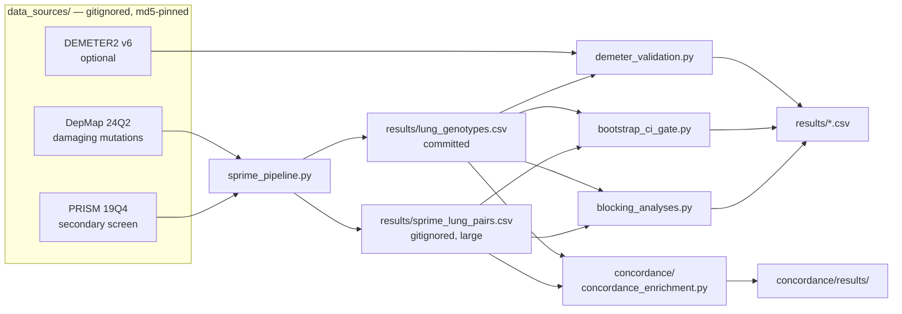

# Documentation

This repository computes the S′ drug-response metric on public PRISM and DepMap data for 94 lung cancer
cell lines, calls tumor-suppressor genotypes for four genes, and runs the statistical controls needed to
decide whether the resulting candidate lists mean anything. The short answer is that they largely do not —
only RB1 rises above a label-permutation null, and then only marginally — while RB1's recovery of
Aurora-kinase biology is independently corroborated in the literature and TP53 shows an equally strong but
as-yet-uncorroborated enrichment, both beyond chance under this repository's own literature-blind benchmark
(see [evidence.md](evidence.md)). Everything here is deterministic and checksum-guarded.

## Reading paths

- **Re-run the analysis** — the root [`README.md`](../README.md) quickstart, then
  [`DOWNLOAD_CHECKLIST.md`](../DOWNLOAD_CHECKLIST.md) for the inputs.
- **Understand the metric** — [`method.md`](method.md): why the standard curve summaries fail, what S′ is,
  how genotypes are called.
- **Understand what was established** — [`evidence.md`](evidence.md): the four controls, what each asks,
  and what each found.
- **Understand the limits** — [`scope.md`](scope.md): the analyses this repository does not perform, and
  what a reader must not infer from their absence.
- **Check a claim yourself** — [`verifying.md`](verifying.md): which command substantiates which claim, from
  a seconds-long synthetic test up to a full ~560 MB reproduction, and what each command does and does not
  prove.
- **Explore interactively** — [`dashboard/README.md`](../dashboard/README.md): launch the local React + Vite
  dashboard (`cd dashboard && npm run dev`) to simulate 4PL curves, candidate funnels, DEMETER2 RNAi targets,
  and presentation slides, or run Playwright UI tests (`node verify_ui.js`).

## How the pieces fit

`sprime_pipeline.py` reads the pinned inputs and builds two derived tables — everything downstream reads
only those two tables and rebuilds the compound-by-line matrix itself, rather than touching the raw inputs
again.

## A note on the figures

Every computed figure in these documents is checked against the committed CSVs by
`tests/test_docs_numbers.py`, which runs in CI — if a results table is regenerated, the check fails until
the prose is updated to match. Numbers this repository does not compute — the 4PL pathology percentages and
the PRISM assay design — are attributed inline to their source instead. The companion manuscript (in
review) is not reproduced here.

## Citations

Claims resting on independent literature, rather than on this repository's own computation, are cited
inline where they are made, with full records in a `## References` section at the foot of `method.md`,
`evidence.md`, and `scope.md`.
