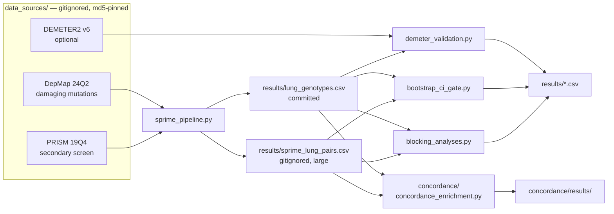

# Documentation

This repository computes the S′ drug-response metric on public PRISM and DepMap data for 94 lung cancer
cell lines, calls tumor-suppressor genotypes for four genes, and runs the statistical controls needed to
decide whether the resulting candidate lists mean anything. The short answer is that they largely do not —
only RB1 rises above a label-permutation null, and then only marginally. Under this repository's
literature-blind benchmark, **only RB1 clears chance** — 13/94 at p = 0.0099 against the 2026-08-31
census of record, and it passes the same gate against a second census assembled blind six days later. The
second census corroborates the *target nomination* rather than reproducing the result independently: its
reference set is a strict subset of the first, so the two share almost everything that determines the
answer. The enrichment is carried by the Aurora kinase class. PTEN, CDKN2A and TP53 are concordant
negatives; the TP53–KIF11 signal is an internal empirical finding of this dataset and is **not**
literature-validated (see [evidence.md](evidence.md), and `concordance/RESULT_second_census_2026-09-06.md`
for what the replication does and does not establish). Everything here is deterministic and
checksum-guarded.

## Reading paths

- **Re-run the analysis** — the root [`README.md`](../README.md) quickstart, then
  [`DOWNLOAD_CHECKLIST.md`](../DOWNLOAD_CHECKLIST.md) for the inputs.
- **Understand the metric** — [`method.md`](method.md): why the standard curve summaries fail, what S′ is,
  how genotypes are called.
- **Understand what was established** — [`evidence.md`](evidence.md): the four controls, what each asks,
  and what each found.
- **Understand the limits** — [`scope.md`](scope.md): the analyses this repository does not perform, and
  what a reader must not infer from their absence.
- **Check a claim yourself** — [`verifying.md`](verifying.md): which command substantiates which claim, from
  a seconds-long synthetic test up to a full ~560 MB reproduction, and what each command does and does not
  prove.
- **Explore interactively** — [`dashboard/README.md`](../dashboard/README.md): launch the local React + Vite
  dashboard (`cd dashboard && npm run dev`) to simulate 4PL curves, candidate funnels, DEMETER2 RNAi targets,
  and presentation slides, or run Playwright UI tests (`node verify_ui.js`).

## How the pieces fit

`sprime_pipeline.py` reads the pinned inputs and builds two derived tables — everything downstream reads
only those two tables and rebuilds the compound-by-line matrix itself, rather than touching the raw inputs
again.

```mermaid
flowchart LR
    subgraph inputs["data_sources/ — gitignored, md5-pinned"]
        P["PRISM 19Q4<br/>secondary screen"]
        M["DepMap 24Q2<br/>damaging mutations"]
        D["DEMETER2 v6<br/>optional"]
    end
    P --> SP["sprime_pipeline.py"]
    M --> SP
    SP --> T1["results/sprime_lung_pairs.csv<br/>gitignored, large"]
    SP --> T2["results/lung_genotypes.csv<br/>committed"]
    T1 --> BA["blocking_analyses.py"]
    T2 --> BA
    T1 --> BC["bootstrap_ci_gate.py"]
    T2 --> BC
    T1 --> CE["concordance/<br/>concordance_enrichment.py"]
    T2 --> CE
    T2 --> DV["demeter_validation.py"]
    D --> DV
    BA --> R["results/*.csv"]
    BC --> R
    DV --> R
    CE --> R2["concordance/results/"]
```

## A note on the figures

Figures quoted in `method.md`, `evidence.md`, `verifying.md`, the root `README.md`, `CLAUDE.md` and
`concordance/README.md` are checked against the committed CSVs by `tests/test_docs_numbers.py`, which runs
in CI — if a results table is regenerated, the check fails until the prose is updated to match. `scope.md`
and this index are **not** currently under that check, so treat figures in them as prose to verify by
hand. Numbers this repository does not compute — the 4PL pathology percentages and
the PRISM assay design — are attributed inline to their source instead. The companion manuscript (in
review) is not reproduced here.

## Citations

Claims resting on independent literature, rather than on this repository's own computation, are cited
inline where they are made, with full records in a `## References` section at the foot of `method.md`,
`evidence.md`, and `scope.md`.
