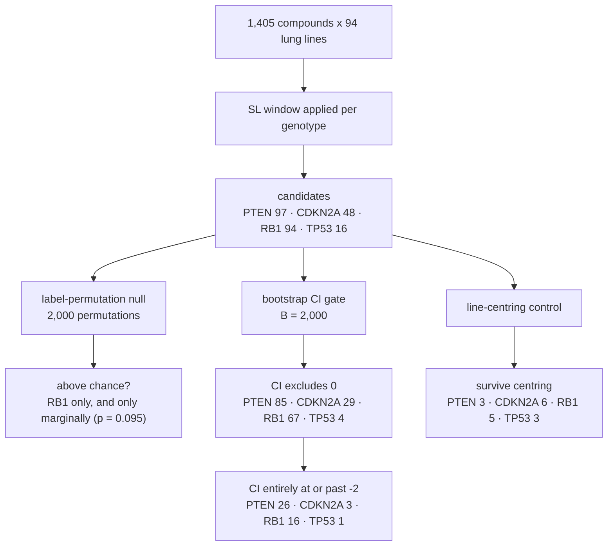
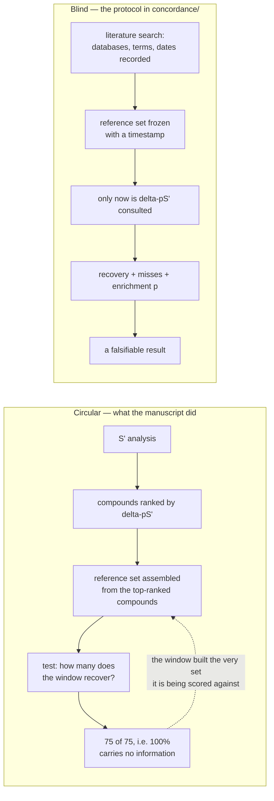

# What the controls established

Applying the synthetic-lethal (SL) window described in [method.md](method.md) produces candidate lists —
compound–genotype pairs that clear pS′_WT > 0, pS′_mutant > 0, ΔpS′ ≤ −2, and the `MIN_LINES = 3` cohort-size
floor. A candidate list on its own does not say whether those candidates are real. This document walks
through the four controls this repository runs against its own output, and states plainly what each one
found. The honest headline is this: under a label-permutation null, only RB1's candidate count rises above
chance, and only marginally; the lists thin sharply again under a bootstrap confidence-interval gate. That
near-null result is a finding of the analysis, not a bug in the code or in this write-up — read the rest of
this document as an account of exactly how much the window's candidate lists can and cannot support.

## A statistics primer

This section assumes familiarity with the pharmacology in `method.md` but no prior background in
statistical inference; four ideas recur throughout the controls below.

A **label-permutation null** shuffles which cell lines carry the "mutant" and "wild type" labels, keeping
every dose-response measurement untouched, and re-runs the identical SL window on the shuffled cohorts. Repeat
this many times and you get a distribution of "how many candidates would this window produce if genotype
carried no information at all?" — comparing the real, unshuffled candidate count against that distribution is
the test.

An **empirical p-value** is the fraction of shuffles that matched or beat the observed candidate count: a
small p-value means shuffled genotype labels almost never produced as many candidates as the real labels did,
which is evidence the real labels are doing something. A **permutation FDR** (false discovery rate) is the
expected number of false candidates a shuffle would produce, divided by the observed candidate count — an FDR
near or above 1 means the list is, on average, expected to contain as many or more false candidates as the
real list has candidates at all, i.e. it is essentially indistinguishable from noise.

A **bootstrap confidence interval** resamples cell lines with replacement, separately within the wild-type
pool and the mutant pool, and recomputes ΔpS′ on each resample. Doing this many times asks how much of the
point-estimate ΔpS′ is an artifact of which particular lines happened to be in the cohort, as opposed to a
stable property of the genotype contrast — a candidate whose resamples swing wildly is one where a handful of
lines are doing all the work.

A **hypergeometric enrichment** test asks whether the overlap between a candidate list and some reference set
exceeds what a random draw of the same list size, from the same universe of tested compounds, would produce
by chance. It is the standard way to ask "is this overlap bigger than luck," given fixed list and universe
sizes.

Finally, a word on **circularity**, because it matters for Control 4 below: a benchmark whose reference set
was itself assembled by selecting the top hits of the very analysis being tested can only recover those hits
— it will always score near 100%, and that number carries no information about whether the analysis is
correct. A benchmark is only informative if its reference set was fixed *before*, and independently of, the
result it is used to score.

## Control 1 — the label-permutation null

This control asks the sharpest question a candidate list can be asked: if genotype carried no real
information, how many candidates would the same window produce by chance alone? `blocking_analyses.py` runs
2,000 label permutations per gene (seed 20260811), reapplying the identical SL window to each shuffled
cohort split, and compares the observed candidate count to that null distribution.

| gene | candidates | null mean | empirical p | permutation FDR |
|---|---|---|---|---|
| PTEN | 97 | 97.0 | 0.461 | 1.00 |
| CDKN2A | 48 | 41.7 | 0.315 | 0.87 |
| RB1 | 94 | 63.6 | 0.095 | 0.68 |
| TP53 | 16 | 20.3 | 0.596 | 1.27 |

Only RB1 (p = 0.095) approaches conventional significance, and it does not reach it. PTEN is the starkest
case: 97 observed candidates against a null mean of 97.0 — the window found exactly as many candidates for
PTEN as randomly shuffled genotype labels would, on average. TP53's observed count (16) sits *below* its null
mean (20.3): the real genotype labels produced fewer candidates than chance. None of the four genes clears a
permutation FDR comfortably below 1; PTEN and TP53 are at or above it, meaning the expected number of false
candidates in those lists is comparable to, or exceeds, the list itself.

## Control 2 — line-centring

There is an obvious confound this control is built to catch: if mutant lines are simply more drug-sensitive
overall — across essentially every compound in the library, not selectively — then every active compound
would acquire a negative ΔpS′ regardless of any real genotype-specific mechanism, and the whole candidate
list would be an artifact of that general offset rather than evidence of selective vulnerability. The test
subtracts each cell line's own median S′, computed across the full compound library, before recomputing pS′
and ΔpS′ — this removes any per-line baseline shift and leaves only compound-specific, relative behavior.

| gene | offset (mut − WT) | raw | centred | correlation |
|---|---|---|---|---|
| PTEN | -0.02 | 97 | 3 | 1.000 |
| CDKN2A | -0.05 | 48 | 6 | 0.999 |
| RB1 | +0.07 | 94 | 5 | 0.999 |
| TP53 | -0.13 | 16 | 3 | 0.996 |

There are two findings here, and both matter, in opposite directions. First, the gross confound this control
was designed to catch is absent: cohort offsets are small (all within about a tenth of an S′ unit) and ΔpS′
is nearly invariant to centring — the correlation column, which compares raw ΔpS′ to line-centred ΔpS′ across
compounds, sits at 0.995 or higher for every gene. This counts in the method's favor. Second, and separately,
centring still removes the large majority of candidates for every gene, because centring pushes pooled pS′
values below zero for many compounds, and those compounds then fail the SL window's absolute "active in both
cohorts" gate (pS′_WT > 0 and pS′_mutant > 0) even though their *relative* ΔpS′ is essentially unchanged. The
candidate lists therefore depend heavily on the metric's absolute-scale anchoring, which is exactly why
`method.md` treats the percent scale and the 1 µM reference concentration as load-bearing choices rather than
arbitrary conventions.

The correlation column's PTEN value of 1.000 is a rounded 0.99994, not a claim of an exact identity between
raw and centred ΔpS′.

## Control 3 — the bootstrap CI gate

This control layers three successively stricter gates on top of the raw candidate count: the point-estimate
gate already in the SL window (ΔpS′ ≤ −2, the manuscript's rule), a gate requiring the bootstrap 95%
confidence interval's upper bound to fall below 0 (selectivity distinguishable from zero, not merely a point
estimate that happens to land past threshold), and the strictest gate, requiring the *entire* confidence
interval to sit at or past −2 (the whole plausible range of the estimate clears the effect-size bar, not just
its center).

| gene | point ≤ −2 | + CI < 0 | + CI ≤ −2 |
|---|---|---|---|
| PTEN | 97 | 85 | 26 |
| CDKN2A | 48 | 29 | 3 |
| RB1 | 94 | 67 | 16 |
| TP53 | 16 | 4 | 1 |

PTEN's 26 survivors at the strictest gate rest on a mutant pool of only three cell lines (see the WT/mutant
counts in `method.md`), so their bootstrap intervals are effectively degenerate — resampling three items with
replacement has very limited ability to represent true sampling variation — and that count should not be read
as evidence of robustness. TP53 loses three quarters of its candidates (16 → 4) at the weakest of the three
gates alone.

This gate does not, and cannot, remove implausible hits driven by flat or noise-dominated curves: a compound
whose fitted curve is stable but pharmacologically artifactual — for instance a poor fit that happens to be
reproducibly poor across resamples — passes a tight confidence interval just as readily as a genuine effect
does. A narrow CI is evidence of *consistency* across resamples, not evidence of *correctness* of the
underlying fit. See [scope.md](scope.md) for the fit-quality caveats this gate does not address.

## Control 4 — the concordance benchmark

The manuscript's own concordance check is circular by construction: its reference set of known
vulnerabilities was assembled from compounds that had already passed the SL window, so recovering "75 of 75"
reference compounds and reporting 100% recovery was guaranteed before a single comparison was run — the
window built the very set it was later scored against, so that number carries no information (see the primer
above).

This repository's `concordance/` module instead specifies a protocol meant to avoid that trap: assemble a
reference set from the published literature alone, independent of this analysis's own output, recording the
databases searched, the search terms used, and the search dates; freeze that reference set with a timestamp
before any candidate list is consulted; and only then compute recovery, misses, and a hypergeometric
enrichment p-value against the frozen set.

| gene | reference in universe | recovered | hypergeometric p |
|---|---|---|---|
| PTEN | 10 | 2 | 0.3 |
| RB1 | 49 | 10 | 0.0013 |
| TP53 | 5 | 4 | 5.6e-08 |

CDKN2A has no reference entries in the current starter set and cannot be benchmarked at all, which is why it
is absent from the table above. The result against this starter set should be read as illustrative of the
protocol rather than as a finished, comprehensive benchmark — the starter set itself is a first pass, not a
systematic literature review, and its own provenance gaps are documented in [scope.md](scope.md).

With that caveat, the honest reading is this: RB1 and TP53 recover specific, well-established biology at
well beyond what chance overlap would predict (p = 0.0013 and p = 5.6×10⁻⁸ respectively), even though their
overall candidate lists sit near the permutation null in Control 1. Put together, the SL window recovers real
pharmacology for at least these two genes without behaving as a general-purpose, genome-wide selective
classifier — the two results are not in tension, they describe different things.

## Cross-check — DEMETER2 RNAi

The controls above all operate on the same drug-response data the SL window was built from. `demeter_validation.py`
provides an orthogonal cross-check using a different modality entirely: DEMETER2 genetic-dependency scores from
RNAi knockdown, rather than small-molecule drug response. The construction deliberately mirrors the drug-side
metric so the two are comparable: D = −DEMETER2, so that a positive D means a gene knockdown was more damaging
to a cell line, i.e. that line is more *dependent* on the gene — the same sign convention S′ uses for "more
inhibited." ΔpD = pD_WT − pD_mutant, matching ΔpS′'s WT-minus-mutant convention, so a negative ΔpD again means
the mutant cohort is more dependent than the wild-type cohort on knockdown of that gene.

The informative result here is RB1. In the same contrast, the RB–E2F axis comes out mutant-selective (RB1-null
lines are more dependent on RB–E2F pathway components) while CDK4/6 comes out wild-type-selective (RB1-intact
lines are more dependent on CDK4/6). This is the expected positive control, not a coincidence: RB1-intact
cells rely on CDK4/6 to phosphorylate and inactivate RB1 and permit cell-cycle progression, while RB1-null
cells have already lost that checkpoint and bypass the CDK4/6 dependency entirely, instead becoming more
reliant on the downstream E2F machinery RB1 would otherwise restrain. Recovering both directions correctly, in
one analysis, is an internal control on contrast direction — not merely one more hit list to add to the count.

There is a reading trap worth flagging explicitly: the one-sided q-value in this analysis tests only the
hypothesis "mutant is more dependent than wild type." A genuine, real wild-type-selective effect — like the
CDK4/6 result above — will score a one-sided q close to 1, which looks like "no effect" if read carelessly,
when it is actually a strong effect in the *other* direction. Always read the `direction` column before
looking at any q-value at all, and prefer the two-sided `q_two` column when the direction itself is the
question rather than assumed in advance.

This section deliberately does not quote per-target DEMETER2 figures: `demeter_validation.py` requires an
optional DEMETER2 input file that is not part of this repository's pinned inputs, and its output is
accordingly not committed to `results/`. Any specific number quoted here would be unverifiable against
committed data, which is precisely the standard this repository's other figures are held to.

## What this adds up to

Four controls, four different angles on the same candidate lists, and one consistent picture. The candidate
lists as a whole are largely indistinguishable from what random genotype labels would produce — only RB1
approaches significance under the permutation null, and only marginally. The general-sensitivity confound
that line-centring was built to catch is genuinely absent, which is real evidence in the method's favor. The
lists nonetheless depend heavily on the metric's absolute-scale anchoring, thinning sharply once cell lines
are centred or once a bootstrap confidence interval is required to clear the effect-size threshold as a whole
rather than just at its point estimate. And specific, well-established biology is recovered well beyond chance
for RB1 and TP53 under an independent literature benchmark, with an independent RNAi cross-check confirming
the RB1 direction specifically. That combination — a near-null result at the level of the whole candidate
list, alongside real recovery of specific known biology — supports a narrow claim about this method, not a
broad one: it is not evidence of a general-purpose genome-wide selective-vulnerability classifier, but it is
evidence that the window can and does recover real, specific pharmacology for at least some genotypes.
