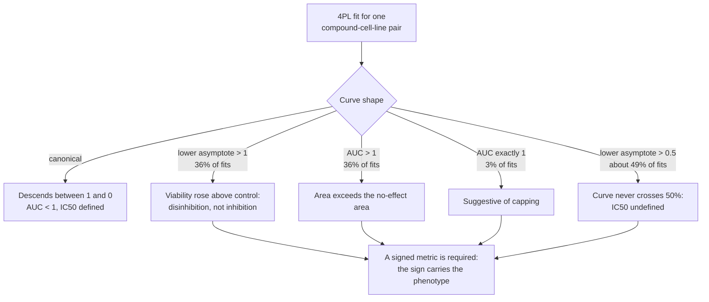
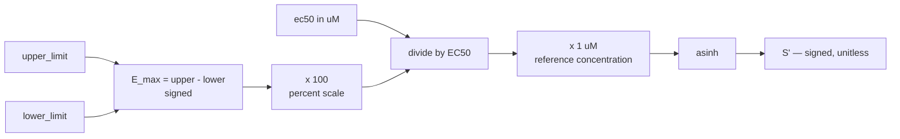
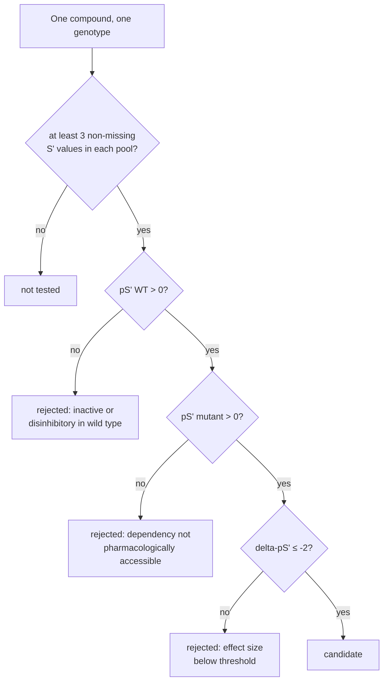
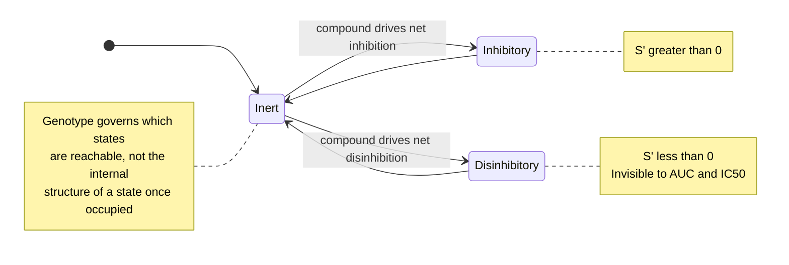
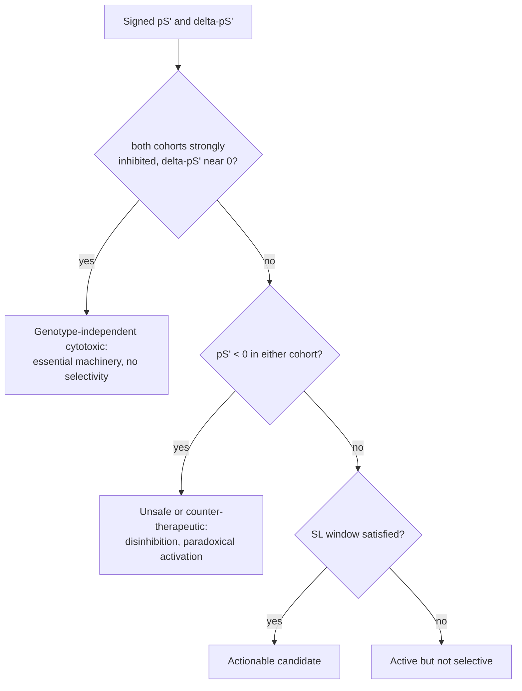
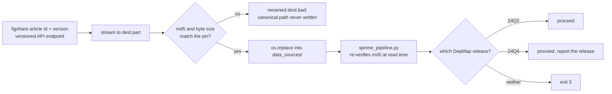

# The S′ metric

This document explains the S′ metric this repository computes from dose-response curves, how it
aggregates into pS′ and ΔpS′ per genotype cohort, and how the tumor-suppressor genotypes themselves are
called from the DepMap mutation matrix. It assumes no prior background in pharmacology and no prior
background in statistics — every term is defined at first use. For what the resulting analysis
established, see [evidence.md](evidence.md); for what it does not establish and where it can mislead, see
[scope.md](scope.md).

## Why the standard summaries fail

A drug-response curve — the viability of a cell line measured across a dilution series of a compound — is
normally summarized by one of two numbers: AUC (area under the curve) or IC₅₀ (the concentration at which
viability crosses 50% of the untreated control). Both summaries assume the curve behaves canonically: full
viability at the lowest dose, descending monotonically toward zero as dose increases. That assumption holds
for a textbook cytotoxic compound. It does not hold across a public screen run on thousands of
compound–cell-line pairs, many of which show no effect, a partial effect, or an effect in the wrong
direction.

The companion manuscript (in review) audited the four-parameter logistic (4PL) fits underlying this PRISM
secondary screen (Corsello et al. 2020, PMID 32613204 [L1]) and found that 36% have a lower asymptote above
1.0, 36% have an AUC above 1.0, 3% have an AUC at exactly 1.0 (suggestive of instrument or analysis capping),
and roughly 49% have a lower asymptote above 0.5 — meaning the curve never reaches 50% viability, so IC₅₀ is
undefined for very nearly half the fits. A lower asymptote above 1.0 has a specific physical meaning: at the
highest tested concentration, treated cells were *more* viable than untreated control. The compound did not
inhibit growth; it disinhibited it.
AUC and IC₅₀ have no vocabulary for that outcome — both either compress it toward "no effect" or fail to
compute at all. A summary that cannot represent a negative response discards exactly the phenotype a
synthetic-lethality screen most needs to keep.

## A pharmacology primer

Each compound–cell-line pair here is fit with a four-parameter logistic (4PL) curve — the standard curve
shape for a dilution-series dose-response experiment. The four parameters are the upper asymptote
(viability at the lowest, near-zero dose, normally close to 1.0), the lower asymptote (viability at the
highest tested dose), the Hill slope (how steeply viability transitions between the two asymptotes), and
EC₅₀ (the concentration at the transition's midpoint).

Two quantities derived from the fit matter here. E_max is the signed difference between the upper and
lower asymptote — how far viability moved, and in which direction — expressed on the 0–100 percent scale.
EC₅₀ is the concentration producing half of that maximal effect; it differs from IC₅₀, which is defined
only as the concentration at which viability crosses 50% in absolute terms. A curve whose lower asymptote
never drops below 50% still has a perfectly well-defined EC₅₀ (it still has a transition) but no IC₅₀ at
all (it never crosses the 50% line). AUC is the area under the fitted response curve; for an inactive
compound the curve sits at 1.0 across the whole dose range and AUC compresses toward 1.

## S′ defined

S′ = asinh((E_max / EC₅₀) × 1 µM), defined once in `sprime_core.py` as the single source of truth for the
metric.

Each piece does a specific job. E_max is signed (upper − lower asymptote), so a compound that inhibits
growth contributes a positive number and a compound that disinhibits growth — raises viability above
control — contributes a negative one; the sign of S′ inherits directly from the sign of E_max. Dividing by
EC₅₀ folds potency into the same number as efficacy: a compound that produces a large E_max only at a very
high concentration scores lower than one that produces the same E_max at a much lower concentration.
Multiplying by a 1 µM reference concentration makes the ratio dimensionless, so S′ values are comparable
across compounds regardless of the units EC₅₀ happened to be reported in.

asinh (inverse hyperbolic sine) rather than log is the deliberate choice for the outer transform — a
methodological convention stated and adopted here, not a transform inherited from a cited external standard.
Unlike log, asinh accepts negative, zero, and positive arguments without special-casing — essential here,
since E_max / EC₅₀ can be negative. It behaves almost linearly for arguments near zero and almost
logarithmically for large-magnitude arguments, so it preserves sign and rank order while compressing
extremes: one extremely potent compound cannot single-handedly drag a cohort mean.

Both anchoring choices in the formula are choices, not derivations, and both are load-bearing. E_max is on
the percent (0–100) scale, not the fraction (0–1) scale, and the reference concentration is 1 µM, not the
screen's actual top dose. What re-anchoring would actually disturb, though, is not the obvious thing.
Multiplying the reference concentration by 10 does not add one constant to every S′: asinh approaches a
fixed ln 10 ≈ 2.30 offset only for arguments far from zero, that offset carries the sign of S′ — upward for
inhibitory compounds, downward for the disinhibitory ones this document's opening section defends — and in asinh's
near-linear region around zero the value is scaled by roughly 10 instead of offset at all. And a shift
applied equally to both cohort means would cancel exactly in ΔpS′ = pS′_WT − pS′_mutant, so the ΔpS′ ≤ −2
threshold is not what the anchoring holds up. What it holds up is the window's two *absolute* activity
gates, pS′_WT > 0 and pS′_mutant > 0, which are stated in absolute S′ units rather than in ranks or
percentiles. Control 2 in [evidence.md](evidence.md) demonstrates exactly that mechanism from the other
direction: shifting pooled pS′ leaves ΔpS′ almost untouched, yet most candidates drop out because they stop
clearing "active in both cohorts." The anchoring is not cosmetic.

## pS′ and ΔpS′

pS′ is the cohort mean of S′: for one compound, the average S′ across every cell line in a genotype pool
(wild type or mutant). ΔpS′ = pS′_WT − pS′_mutant. A negative ΔpS′ means the compound inhibits growth more
in the mutant cohort than in the wild-type cohort — mutant-selective inhibition, the pattern a
synthetic-lethality screen is looking for.

The sign here trips up readers on first read: because ΔpS′ is WT minus mutant, a *more negative* ΔpS′ is a
*stronger* candidate. −5 is a better hit than −2.

## The synthetic-lethal window

A compound–genotype pair is called a candidate only if it clears three conditions on pS′, plus one
condition on measurement coverage.

pS′_WT > 0 requires the wild-type response to be a genuine inhibition, not a null effect or a
disinhibition — without this, ΔpS′ could go very negative simply because the wild-type cohort responded
paradoxically, which is not the phenomenon of interest. pS′_mutant > 0 requires the mutant response to
likewise be a real inhibition, not merely "less bad than wild type" — this makes the dependency
pharmacologically accessible, not just nominally present in the arithmetic. ΔpS′ ≤ −2 imposes a minimum
effect size: it is not enough for the mutant cohort to be somewhat more sensitive, the gap must clear a
fixed threshold. The repository adds a fourth, non-statistical condition: `MIN_LINES = 3`. What that
condition counts is coverage, not pool size — for each compound separately, at least three *non-missing* S′
measurements in the wild-type pool and at least three in the mutant pool (`blocking_analyses.py:22`), below
which that compound's cohort mean is not trusted. The distinction shows up in the tested universe: PTEN's
mutant pool holds exactly three lines, so a compound missing a measurement in any one of them drops out
entirely, leaving 883 testable compounds for PTEN against 1,402 for CDKN2A and TP53.

Because the first two conditions push qualifying candidates into a pS′ range of roughly 2 to 4, the
ΔpS′ ≤ −2 threshold has a fold-change reading: in that range, it amounts in practice to requiring roughly a
7.4-fold (e²) greater potency–efficacy ratio in mutant cells than in wild-type cells, and
`sprime_core.fold_change` computes exactly this conversion. The correspondence between ΔpS′ and a clean
fold-change is an approximation that degrades once pS′ drops below roughly 1, where asinh's near-linear
region gives way to its logarithmic one.

## Why the sign is kept

The companion manuscript frames this as the reason a signed metric is non-negotiable: one signed axis on
pS′ and ΔpS′ separates three outcomes a screen has to be able to tell apart. An actionable candidate has
positive pS′ in both cohorts with a ΔpS′ past threshold — inhibition, and more of it in the mutant cohort.
An unsafe or counter-therapeutic state shows up as a negative pS′ in either cohort — disinhibition, which
AUC and IC₅₀ cannot even register. And genotype-independent cytotoxicity — a compound that kills wild-type
and mutant cells alike because it hits essential machinery rather than a genotype-specific vulnerability —
shows up as strong inhibition in both cohorts with ΔpS′ near zero. Collapsing the sign, as AUC and IC₅₀ do,
collapses these three into one indistinguishable bucket.

## Calling genotypes

Genotypes are called from a damaging-mutation matrix in which each gene–cell-line entry is coded 0 (wild
type), 2 (mutant), or 1 (excluded — an ambiguous or non-damaging call that is dropped from both cohorts
rather than assigned to either). Four tumor-suppressor genes are called this way: PTEN, CDKN2A, RB1, and
TP53, across the 94 lung lines the pipeline analyzes.

| gene | WT | mutant | excluded |
|---|---|---|---|
| PTEN | 90 | 3 | 1 |
| CDKN2A | 77 | 13 | 4 |
| RB1 | 84 | 8 | 2 |
| TP53 | 17 | 73 | 4 |

Three things about this table are easy to misread. First, for TP53 the *wild-type* cohort is the small one
(17 lines) and the mutant cohort is large (73) — the reverse of PTEN, CDKN2A, and RB1, and the reverse of
what a reader skimming "TP53 mutation" as the rare case would assume; outlier sensitivity for TP53 results
applies to the wild-type side. Second, PTEN's mutant cohort has only 3 lines — exactly the coverage
minimum, so a compound must be measured in every one of them to be tested at all, and every PTEN result
rests on those three lines and should be read as fragile. Third, these counts are reproducible from the
pinned public inputs — Tier 1 in [verifying.md](verifying.md) walks through `fetch_data.py` and
`run_all.py`. They are the counts this code produces from the committed DepMap release; the companion
manuscript's Supplement 9 reports 80/13
for CDKN2A and 18/72 for TP53, and `sprime_pipeline.py` treats the difference as acceptable because its
built-in tolerance is ±3 wild-type and ±2 mutant lines per gene. PTEN and RB1 reproduce the manuscript's
counts exactly; CDKN2A and TP53 are close but not identical, and should not be described as reproducing.

## How inputs are pinned

Every input file is resolved through a version-pinned figshare record — article id and version number both
hard-coded, not "latest" — and verified against a hard-pinned md5 and byte size before it is used. A
download that fails verification is quarantined with a `.bad` suffix; the canonical path the pipeline reads
from is never written in that case, so a corrupted or substituted file cannot silently enter the analysis.
The two pinned records this document draws on are the PRISM Repurposing 19Q4 secondary screen,
doi:10.6084/m9.figshare.9393293.v4 [D1], and DepMap Public 24Q2, doi:10.25452/figshare.plus.25880521.v1
[D2]. `sprime_pipeline.py` re-verifies the md5 again at read time and reports which DepMap release (24Q2 or
24Q4) it detected, since the two releases give identical genotype calls for the analyzed genes but are still
worth citing correctly.

## The worked example

One compound–cell-line pair anchors the whole metric to a hand-checkable number: doxorubicin in A549, with
a fitted upper limit of 1.000, lower limit of 0.00103, and EC₅₀ of 0.2449 µM, gives S′ = 6.704. Run this
check yourself in seconds — see Tier 0 in [verifying.md](verifying.md).
`tests/test_synthetic.py::test_sprime_worked_example` recomputes S′ from those inputs on every run and
asserts it lands within 0.05 of 6.70 — a tolerance, not an exact equality, so the check survives ordinary
floating-point variation while still failing on any real change to the formula. This number also
corrects an arithmetic error present in the companion manuscript's own worked example — so if that test
ever starts failing on the arithmetic rather than on stale results, the more likely explanation is a
regression in this code, not a return to the manuscript's original number.

## References

[L1] Corsello SM, Nagari RT, Spangler RD, et al. Discovering the anti-cancer potential of non-oncology drugs
by systematic viability profiling. *Nature Cancer* 2020;1(2):235–248. PMID 32613204.
doi:10.1038/s43018-019-0018-6

[D1] PRISM Repurposing 19Q4 secondary screen (figshare dataset, version 4).
doi:10.6084/m9.figshare.9393293.v4

[D2] DepMap Public 24Q2 (figshare dataset, version 1). doi:10.25452/figshare.plus.25880521.v1
