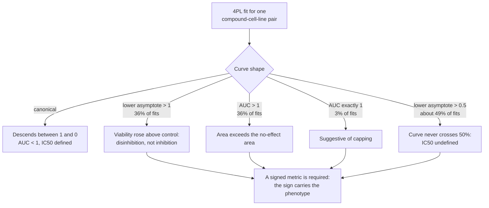
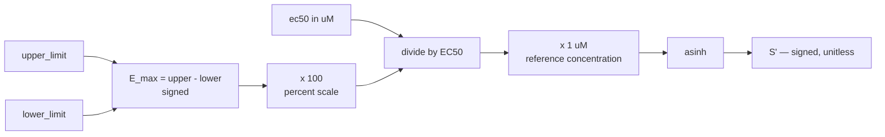
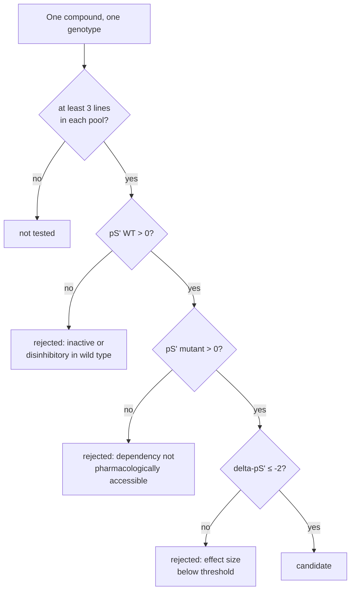
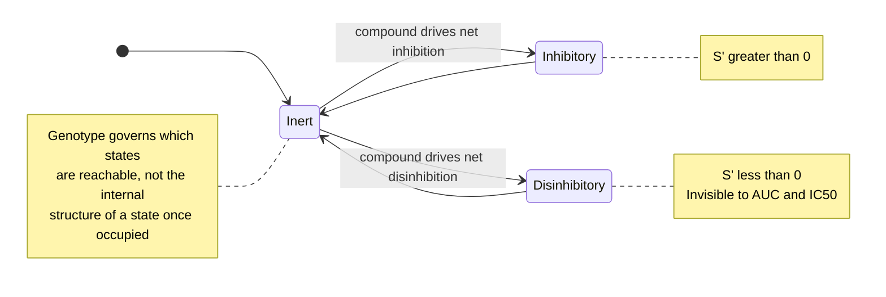
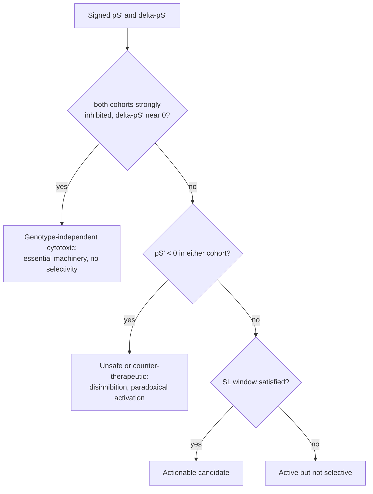
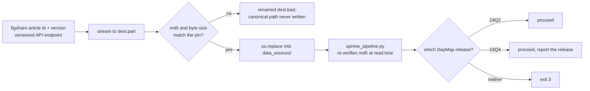
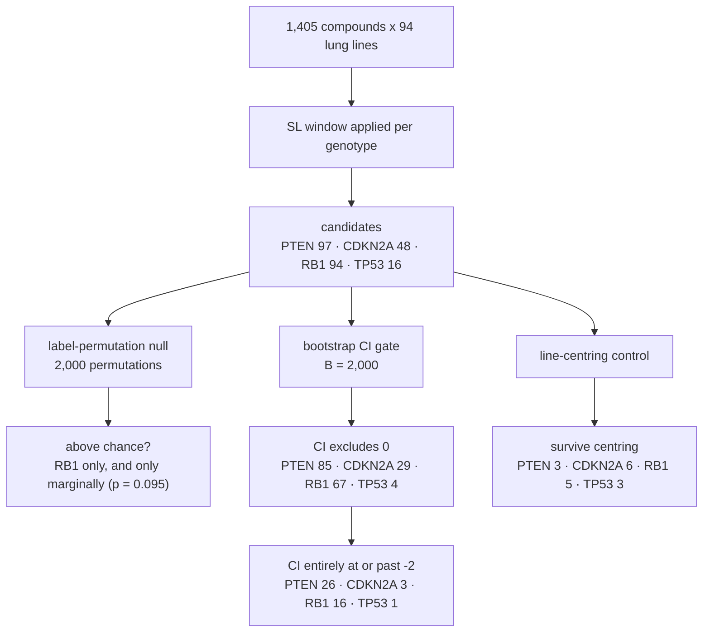
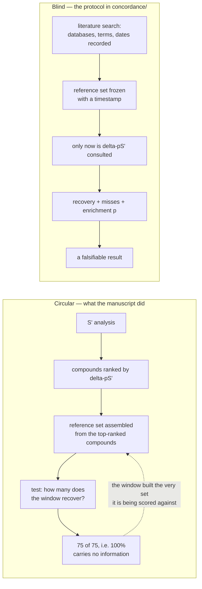
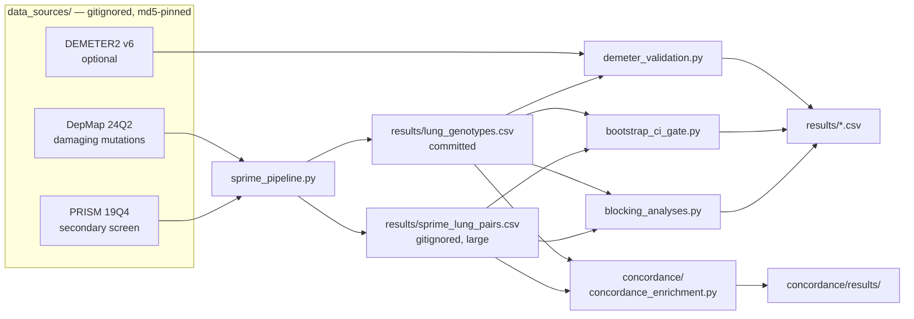

# Explanatory Documentation Implementation Plan

> **For agentic workers:** REQUIRED SUB-SKILL: Use superpowers:subagent-driven-development (recommended) or superpowers:executing-plans to implement this plan task-by-task. Steps use checkbox (`- [ ]`) syntax for tracking.

**Goal:** Add four explanatory documents under `docs/` with nine mermaid diagrams, so a reviewer or reproducer landing on this repository cold can understand the metric, what the controls established, and what the repository does not implement.

**Architecture:** Documentation only — no analysis code changes. `docs/method.md` explains the metric on its own terms; `docs/evidence.md` presents the four statistical controls and their verdict; `docs/scope.md` names what is deliberately not implemented; `docs/README.md` indexes them. A new test asserts that every figure quoted in the docs matches the committed results CSVs, so documentation drift fails CI.

**Tech Stack:** Markdown with GitHub-flavored mermaid fences. Python 3.10+ with numpy and pandas for the consistency test. No new dependencies.

## Global Constraints

- **No pytest in CI.** `.github/workflows/smoke.yml` installs only `numpy pandas` and runs tests as plain scripts (`python tests/test_synthetic.py`). Any new test file MUST be runnable as a bare script and MUST follow the `if __name__ == "__main__":` runner pattern at the bottom of `tests/test_synthetic.py`.
- **No analysis code changes.** Do not modify `sprime_core.py`, `sprime_pipeline.py`, `blocking_analyses.py`, `bootstrap_ci_gate.py`, `demeter_validation.py`, `fetch_data.py`, `run_all.py`, or `concordance/concordance_enrichment.py`.
- **No regenerating `results/`.** The committed CSVs are cited figures. Docs adapt to them, never the reverse.
- **One minus glyph.** Use U+2212 (`−`) in every `ΔpS′ ≤ −2`. Never U+2013 (`–`) or ASCII hyphen in a threshold.
- **Prime glyph.** Use U+2032 (`′`) in S′, pS′, ΔpS′ — matching the existing README and CLAUDE.md.
- **Manuscript stays third-party.** Refer to it as "the companion manuscript (in review)". Do not reproduce its unpublished narrative or abstract claims. Do not include any Google Drive URL.
- **Attribute non-repo numbers inline.** The 4PL pathology percentages and the PRISM assay design are manuscript- and screen-sourced, not computed here. They must read as attributed facts.
- **Mermaid label safety.** Inside mermaid node labels use `&lt;` / `&gt;` for angle brackets, `&le;` for ≤, and write `delta-pS'` rather than the Δ and ′ glyphs. Mermaid's parser mishandles them in several GitHub renderer versions. Prose outside fences uses the proper glyphs.

## Authoritative figures

Every number below was computed from the committed files at plan time. Do not retype from memory.

**Cohorts** (from `results/lung_genotypes.csv`, 94 lung lines; value 0 = WT, 2 = mutant, 1 = excluded):

| gene | WT | mutant | excluded | manuscript Suppl 9 |
|---|---|---|---|---|
| PTEN | 90 | 3 | 1 | 90/3 — matches |
| CDKN2A | 77 | 13 | 4 | 80/13 — differs |
| RB1 | 84 | 8 | 2 | 84/8 — matches |
| TP53 | 17 | 73 | 4 | 18/72 — differs |

The CDKN2A and TP53 differences are real and must be documented. `sprime_pipeline.py:106` accepts them because its tolerance is `|ΔWT| ≤ 3` and `|Δmut| ≤ 2`. The referee review is careful to claim only that RB1 and PTEN reproduce the published cohorts — do not overclaim the other two.

**Permutation null** (`results/candidate_null.csv`): PTEN 97 candidates / 883 tested, null mean 97.0, p 0.461, FDR 1.00. CDKN2A 48 / 1402, 41.7, 0.315, 0.87. RB1 94 / 1360, 63.6, 0.095, 0.68. TP53 16 / 1402, 20.3, 0.596, 1.27.

**Line-centring** (`results/line_centring.csv`): PTEN offset −0.02, raw 97 → centred 3, corr 1.000. CDKN2A −0.05, 48 → 6, 0.999. RB1 +0.07, 94 → 5, 0.999. TP53 −0.13, 16 → 3, 0.996.

**Bootstrap CI gate** (`results/bootstrap_ci_summary.csv`): PTEN 97 → 85 → 26. CDKN2A 48 → 29 → 3. RB1 94 → 67 → 16. TP53 16 → 4 → 1.

**Concordance** (`concordance/results/concordance_report.csv`): PTEN 10 in universe, 2 recovered, hypergeometric 0.3. CDKN2A 0 in universe — untestable. RB1 49, 10 recovered, 0.0013. TP53 5, 4 recovered, 5.6e-08.

---

### Task 1: Number-consistency test and `docs/method.md`

**Files:**
- Create: `tests/test_docs_numbers.py`
- Create: `docs/method.md`

**Interfaces:**
- Consumes: nothing from earlier tasks.
- Produces: `tests/test_docs_numbers.py` exposing module-level helpers `_read(rel_path) -> pandas.DataFrame`, `_doc(name) -> str`, `_assert_in(text, needle, doc_name, source) -> None`, `_assert_one_row_per_gene(df, source) -> None`, and `_table_rows_after(text, heading, doc_name) -> list[str]`, plus the module-level `GENES` list. Task 2 adds test functions to this same file and reuses all of them with those exact names and signatures.

- [ ] **Step 1: Write the failing test**

Create `tests/test_docs_numbers.py`:

```python
"""Figures quoted in docs/ must match the committed results CSVs.

Runs in CI: every CSV read here is committed, so no gated DepMap/PRISM input is
needed. If a results table is regenerated, the formatted string changes and the
assertion fails until the prose is updated. This is the documentation analogue
of test_sprime_worked_example freezing the 6.704 anchor.
"""
import os
import sys
import pandas as pd

HERE = os.path.dirname(os.path.abspath(__file__))
ROOT = os.path.dirname(HERE)

GENES = ["PTEN", "CDKN2A", "RB1", "TP53"]


def _read(rel_path):
    """Read a committed results CSV by repo-relative path."""
    return pd.read_csv(os.path.join(ROOT, rel_path))


def _doc(name):
    """Read a file from docs/ as text."""
    with open(os.path.join(ROOT, "docs", name), encoding="utf-8") as f:
        return f.read()


def _assert_in(text, needle, doc_name, source):
    assert needle in text, (
        f"docs/{doc_name} does not contain {needle!r}, which is derived from "
        f"{source}. The committed results changed, or the prose drifted — "
        f"update the document to match."
    )


def _assert_one_row_per_gene(df, source):
    """Guard the converse direction: a shrunken CSV must not pass vacuously.

    Every row-by-row check below iterates the CSV, so a CSV that lost rows (or
    is empty) would assert nothing at all and leave a stale phantom row in the
    prose forever. Pin the shape first.
    """
    assert list(df.gene) == GENES, (
        f"{source} holds gene rows {list(df.gene)}, expected exactly {GENES}. "
        f"The committed results changed shape, so the row-by-row checks below "
        f"can no longer prove the document is current — regenerate or fix "
        f"{source} before trusting the docs."
    )


def _table_rows_after(text, heading, doc_name):
    """Data rows of the first markdown table following `heading`."""
    assert heading in text, f"docs/{doc_name} has no {heading!r} section."
    lines, started = [], False
    for line in text.split(heading, 1)[1].splitlines():
        if line.startswith("|"):
            started = True
            lines.append(line)
        elif started:
            break
    assert len(lines) >= 2, (
        f"docs/{doc_name} has no markdown table under {heading!r}."
    )
    return lines[2:]  # drop the header row and the |---|---| separator


def test_method_states_computed_cohort_sizes():
    """method.md must quote the cohorts the code actually produces."""
    g = _read("results/lung_genotypes.csv").set_index("ModelID")
    doc = _doc("method.md")
    for gene in ("PTEN", "CDKN2A", "RB1", "TP53"):
        v = g[gene]
        n_wt = int((v == 0).sum())
        n_mut = int((v == 2).sum())
        _assert_in(doc, f"| {gene} | {n_wt} | {n_mut} |", "method.md",
                   "results/lung_genotypes.csv")


def test_method_states_line_count():
    """The analyzed line count is a headline figure and must be current."""
    g = _read("results/lung_genotypes.csv")
    _assert_in(_doc("method.md"), f"{len(g)} lung", "method.md",
               "results/lung_genotypes.csv row count")


if __name__ == "__main__":
    failures = 0
    for name, fn in sorted(globals().items()):
        if name.startswith("test_") and callable(fn):
            try:
                fn()
                print("ok", name)
            except AssertionError as e:
                failures += 1
                print("FAIL", name, "\n ", e)
    if failures:
        sys.exit(1)
    print("ALL PASSED")
```

- [ ] **Step 2: Run the test to verify it fails**

Run: `python3 tests/test_docs_numbers.py`
Expected: FAIL — `FileNotFoundError` on `docs/method.md`, because the document does not exist yet.

- [ ] **Step 3: Write `docs/method.md`**

Create the document with these sections in this order. Write real explanatory prose; the specifications below fix the content and the figures, not the wording.

**Title and lead.** `# The S′ metric` and one paragraph: this document explains the metric the code computes and how genotype cohorts are called. State that it assumes no prior pharmacology and no prior statistics. Link forward to `evidence.md` for what the analysis established and `scope.md` for its limits.

**§ Why the standard summaries fail.** Two paragraphs. A drug-response curve is normally summarized by AUC or IC₅₀, both of which assume the curve descends monotonically from full viability toward zero. Report — attributed explicitly to the companion manuscript's own audit of the DepMap fits, not as a figure computed here — that 36% of fits have a lower asymptote above 1.0, 36% have AUC above 1.0, 3% have AUC at exactly 1.0 suggesting capping, and roughly 49% have lower asymptotes above 0.5 so IC₅₀ is undefined. Explain what a lower asymptote above 1.0 physically means: viability *rose* relative to untreated control, so the compound disinhibited rather than inhibited. Conclude that a summary which cannot represent a negative response discards the phenotype. Follow with diagram D2.

**§ A pharmacology primer.** For a reader who has never fitted a dose-response curve. Define the 4PL fit and its four parameters; E_max as the signed difference between the upper and lower asymptote; EC₅₀ as the concentration producing half the maximal effect, and how it differs from IC₅₀ (which requires the curve to cross 50% absolute viability and is therefore undefined for a curve that never gets there); and AUC as area under the response curve, with the note that it compresses toward 1 for inactive compounds.

**§ S′ defined.** State `S′ = asinh((E_max / EC₅₀) × 1 µM)`, citing `sprime_core.py` as the single source of truth. Explain each piece: E_max is signed, so inhibition is positive and disinhibition negative; dividing by EC₅₀ makes the index reward both efficacy and potency; multiplying by a 1 µM reference makes the argument dimensionless. Explain why asinh rather than log — it accepts negative, zero, and positive arguments, behaves nearly linearly near zero and nearly logarithmically for large magnitudes, and preserves sign and rank order while compressing extremes so that one very potent compound cannot dominate a cohort mean. State both anchoring choices explicitly as choices: E_max is on the percent (0–100) scale, and 1 µM is the reference. Then explain, correctly, why they are load-bearing. Re-anchoring to the screen's 10 µM top dose is **not** a uniform +2.30 shift and must not be written as one: asinh approaches the ln 10 offset only asymptotically, that offset carries the sign of S′ (it is −2.30 for the disinhibitory values this document spends its opening section defending), and in asinh's near-linear region around zero the value is scaled by roughly 10 rather than offset. Do **not** claim the shift moves compounds across the ΔpS′ ≤ −2 threshold — a shift applied equally to pS′_WT and pS′_mutant cancels exactly in their difference. What re-anchoring moves is the window's **absolute activity gates**, pS′_WT > 0 and pS′_mutant > 0, which are stated in absolute S′ units rather than ranks or percentiles; cross-reference Control 2 in `evidence.md`, where centring removes the large majority of candidates by exactly that mechanism while leaving ΔpS′ nearly invariant. Follow with diagram D3.

**§ pS′ and ΔpS′.** pS′ is the cohort mean of S′ across cell lines for one compound. ΔpS′ = pS′_WT − pS′_mutant. Negative means mutant-selective inhibition. Note the asymmetry that trips readers: a *more negative* ΔpS′ is a *stronger* candidate.

**§ The synthetic-lethal window.** The three conditions and why each exists: pS′_WT > 0 makes the effect an interpretable inhibition rather than a disinhibition or a null; pS′_mutant > 0 makes the dependency pharmacologically accessible rather than merely nominal; ΔpS′ ≤ −2 imposes a minimum effect size. Add the repo-level fourth condition, `MIN_LINES = 3` per pool. Then give the fold-change reading: because the window forces candidates into the pS′ ≈ 2–4 band, ΔpS′ ≤ −2 amounts in practice to requiring roughly a 7.4-fold (e²) greater potency–efficacy ratio in mutant cells, and `sprime_core.fold_change` computes exactly this. Note the correspondence degrades below pS′ ≈ 1. Follow with diagram D4.

**§ Why the sign is kept.** Short section. One signed axis separates three outcomes a screen must distinguish: actionable genotype-selective candidates, unsafe or counter-therapeutic states, and genotype-independent cytotoxicity where ΔpS′ sits near zero because the target is essential machinery in every cell. Attribute this framing to the companion manuscript. Follow with diagrams D5 and D6.

**§ Calling genotypes.** The damaging-mutation matrix encodes 0 as wild type, 2 as mutant, and 1 as excluded. Four genes are called: PTEN, CDKN2A, RB1, TP53. Present this table verbatim — the test asserts each row:

```markdown
| gene | WT | mutant | excluded |
|---|---|---|---|
| PTEN | 90 | 3 | 1 |
| CDKN2A | 77 | 13 | 4 |
| RB1 | 84 | 8 | 2 |
| TP53 | 17 | 73 | 4 |
```

The surrounding prose must contain the exact string `94 lung` (the test asserts it) and must make three points. First, for TP53 the *wild-type* cohort is the small one, so outlier sensitivity applies to the wild-type side — the opposite of the reader's likely assumption. Second, PTEN's three mutant lines make every PTEN result fragile. Third, these counts are what the code produces; the companion manuscript's Supplement 9 reports 80/13 for CDKN2A and 18/72 for TP53, and `sprime_pipeline.py` accepts the difference because its tolerance is ±3 wild-type and ±2 mutant lines. PTEN and RB1 reproduce exactly; CDKN2A and TP53 are close but not identical. Do not describe all four as reproducing.

**§ How inputs are pinned.** Every input is resolved through a version-pinned figshare record and verified by md5 and byte size before use; a file failing verification is quarantined as `.bad` and the canonical path is never written. The pipeline re-verifies at read time and reports which DepMap release it detected. Follow with diagram D7.

**§ The worked example.** doxorubicin in A549: upper limit 1.000, lower limit 0.00103, EC₅₀ 0.2449 µM gives S′ = 6.704. `tests/test_synthetic.py::test_sprime_worked_example` asserts this. Note that it corrects an arithmetic error in the companion manuscript's own worked example, so the test's failure would mean the manuscript was right and this code is wrong.

Insert these diagrams at the points named above.

D2:

````markdown

````

D3:

````markdown

````

D4:

````markdown

````

D5:

````markdown

````

D6:

````markdown

````

D7:

````markdown

````

- [ ] **Step 4: Run the test to verify it passes**

Run: `python3 tests/test_docs_numbers.py`
Expected: PASS — `ok test_method_states_computed_cohort_sizes`, `ok test_method_states_line_count`, `ALL PASSED`.

- [ ] **Step 5: Verify the diagrams render**

Open `docs/method.md` in a GitHub markdown preview (or push the branch and view it). Confirm all six mermaid blocks render as diagrams, not as error boxes or raw text. If any fail, the usual cause is an unescaped `<`, `>`, or `≤` inside a node label — replace with `&lt;`, `&gt;`, `&le;`.

- [ ] **Step 6: Commit**

```bash
git add tests/test_docs_numbers.py docs/method.md
git commit -m "docs: explain the S-prime metric, with a test pinning its figures to results/"
```

---

### Task 2: `docs/evidence.md`

**Files:**
- Create: `docs/evidence.md`
- Modify: `tests/test_docs_numbers.py` — append four test functions before the `if __name__ == "__main__":` block

**Interfaces:**
- Consumes: `GENES`, `_read`, `_doc`, `_assert_in`, `_assert_one_row_per_gene`, `_table_rows_after` from Task 1, unchanged signatures. Every one of these tests iterates a CSV, so each MUST open with the matching shape guard — without it a truncated or empty results table makes the loop body run zero times and the test print `ok` while the document keeps a stale row.
- Produces: nothing consumed by later tasks.

- [ ] **Step 1: Write the failing tests**

Append to `tests/test_docs_numbers.py`, immediately before the `if __name__ == "__main__":` block:

```python
def test_evidence_permutation_null_table():
    """The permutation-null row for each genotype must match candidate_null.csv."""
    df = _read("results/candidate_null.csv")
    _assert_one_row_per_gene(df, "results/candidate_null.csv")
    doc = _doc("evidence.md")
    for r in df.itertuples():
        row = (f"| {r.gene} | {int(r.candidates)} | {r.null_mean:.1f} | "
               f"{r.emp_p:.3f} | {r.perm_fdr:.2f} |")
        _assert_in(doc, row, "evidence.md", "results/candidate_null.csv")


def test_evidence_line_centring_table():
    """The line-centring row for each genotype must match line_centring.csv."""
    df = _read("results/line_centring.csv")
    _assert_one_row_per_gene(df, "results/line_centring.csv")
    doc = _doc("evidence.md")
    for r in df.itertuples():
        row = (f"| {r.gene} | {r.offset_mut_minus_wt:+.2f} | {int(r.raw)} | "
               f"{int(r.centred)} | {r.corr_dps:.3f} |")
        _assert_in(doc, row, "evidence.md", "results/line_centring.csv")


def test_evidence_bootstrap_table():
    """The bootstrap survivor row for each genotype must match the summary CSV."""
    df = _read("results/bootstrap_ci_summary.csv")
    _assert_one_row_per_gene(df, "results/bootstrap_ci_summary.csv")
    doc = _doc("evidence.md")
    for r in df.itertuples():
        row = (f"| {r.gene} | {int(r.point)} | {int(r.ci_excl0)} | "
               f"{int(r.ci_le_minus2)} |")
        _assert_in(doc, row, "evidence.md", "results/bootstrap_ci_summary.csv")


def test_evidence_concordance_table():
    """Concordance rows must match; genotypes with an empty reference are skipped."""
    df = _read("concordance/results/concordance_report.csv")
    _assert_one_row_per_gene(df, "concordance/results/concordance_report.csv")
    doc = _doc("evidence.md")
    n_benchmarkable = int((df.ref_in_universe > 0).sum())
    n_in_doc = len(_table_rows_after(doc, "## Control 4", "evidence.md"))
    assert n_in_doc == n_benchmarkable, (
        f"the Control 4 table in docs/evidence.md has {n_in_doc} data rows but "
        f"concordance/results/concordance_report.csv has {n_benchmarkable} "
        f"genotypes with a non-empty reference set. A genotype was added or "
        f"lost — the document is quoting a row the results no longer support, "
        f"or omitting one they now do."
    )
    for r in df.itertuples():
        if int(r.ref_in_universe) == 0:
            continue
        row = (f"| {r.gene} | {int(r.ref_in_universe)} | {int(r.recovered)} | "
               f"{r.hyperg_p:.2g} |")
        _assert_in(doc, row, "evidence.md",
                   "concordance/results/concordance_report.csv")
```

- [ ] **Step 2: Run the tests to verify they fail**

Run: `python3 tests/test_docs_numbers.py`
Expected: FAIL — `FileNotFoundError` on `docs/evidence.md`. The two Task 1 tests still pass.

- [ ] **Step 3: Write `docs/evidence.md`**

**Title and lead.** `# What the controls established` and a paragraph stating the honest headline: applying the window produces candidate lists, but under a label-permutation null only RB1 rises above chance and only marginally, and the lists thin sharply under a bootstrap confidence-interval gate. State plainly that the near-null result is a finding, not a failure of the code.

**§ A statistics primer.** For a reader who knows pharmacology but not inference. Cover four ideas. A *label-permutation null* shuffles the genotype labels and re-runs the identical selection, answering "how many candidates would this window produce if genotype carried no information at all?" An *empirical p-value* is the fraction of shuffles that matched or beat the observed count, while a *permutation FDR* is the expected number of false candidates divided by the observed number — an FDR near or above 1 means the list is essentially all noise. A *bootstrap confidence interval* resamples cell lines with replacement within each pool to ask how much of the ΔpS′ point estimate is an artifact of which lines happened to be in the cohort. A *hypergeometric enrichment* asks whether the overlap between a candidate list and a reference set exceeds what random draws of the same size would give. Finally, explain circularity: a benchmark assembled from the results it later tests can only return 100%, so it measures nothing.

**§ Control 1 — the label-permutation null.** What it asks, how it is run (2,000 permutations, `blocking_analyses.py`, seed 20260811), the table below, and the reading. Only RB1 (p = 0.095) approaches significance and does not reach it; PTEN's observed 97 candidates against a null mean of 97.0 is the starkest case — the window found exactly as many candidates as random labels would. Table, quoted verbatim:

```markdown
| gene | candidates | null mean | empirical p | permutation FDR |
|---|---|---|---|---|
| PTEN | 97 | 97.0 | 0.461 | 1.00 |
| CDKN2A | 48 | 41.7 | 0.315 | 0.87 |
| RB1 | 94 | 63.6 | 0.095 | 0.68 |
| TP53 | 16 | 20.3 | 0.596 | 1.27 |
```

**§ Control 2 — line-centring.** The confound: if mutant lines are simply more drug-sensitive overall, every active compound acquires a negative ΔpS′ and the whole list is artifactual. The test subtracts each line's median S′ across the full library before recomputing. Two findings, and both matter. The gross confound is absent — cohort offsets are small and ΔpS′ is nearly invariant to centring — which counts *in the method's favor*. But centring still removes most candidates, because it pushes pooled pS′ below zero and compounds then fail the absolute "active in both" gate. The lists therefore depend heavily on the metric's absolute-scale anchoring, which is why `method.md` treats the percent scale and the 1 µM reference as load-bearing choices. Table, quoted verbatim:

```markdown
| gene | offset (mut − WT) | raw | centred | correlation |
|---|---|---|---|---|
| PTEN | -0.02 | 97 | 3 | 1.000 |
| CDKN2A | -0.05 | 48 | 6 | 0.999 |
| RB1 | +0.07 | 94 | 5 | 0.999 |
| TP53 | -0.13 | 16 | 3 | 0.996 |
```

Note in prose that the correlation column is between raw and line-centred ΔpS′, and that PTEN's 1.000 is a rounded 0.99994, not an identity.

**§ Control 3 — the bootstrap CI gate.** Three successively stricter gates: the point estimate at or below −2 (the manuscript's rule), the 95% CI upper bound below 0 (selectivity distinguishable from zero), and the whole CI at or past −2. Table, quoted verbatim:

```markdown
| gene | point ≤ −2 | + CI < 0 | + CI ≤ −2 |
|---|---|---|---|
| PTEN | 97 | 85 | 26 |
| CDKN2A | 48 | 29 | 3 |
| RB1 | 94 | 67 | 16 |
| TP53 | 16 | 4 | 1 |
```

In prose: PTEN's 26 survivors rest on three mutant lines, so their intervals are degenerate and the count should not be read as robustness. TP53 loses three quarters of its candidates (16 → 4) at the weaker of the *two bootstrap* gates — name it correctly: the 16 is already the point-estimate gate's output, so the drop belongs to the CI < 0 requirement, not to the ΔpS′ ≤ −2 gate. Add the warning that this gate does *not* remove implausible hits driven by flat curves — a stable but artifactual S′ passes it — and point to `scope.md`.

**§ Control 4 — the concordance benchmark.** Explain the circularity first: the manuscript's reference set was assembled from compounds that had already passed the window, so all 75 of 75 reference compounds passed and recovery was 100% by construction. Then the protocol this repo provides: assemble from literature alone with databases, search terms, and dates recorded; freeze with a timestamp; only then compute recovery, misses, and an enrichment p-value. Present the current result against the grounded starter set, and label it clearly as illustrative rather than a finished benchmark. Table, quoted verbatim:

```markdown
| gene | reference in universe | recovered | hypergeometric p |
|---|---|---|---|
| PTEN | 10 | 2 | 0.3 |
| RB1 | 49 | 10 | 0.0013 |
| TP53 | 5 | 4 | 5.6e-08 |
```

State that CDKN2A has no reference entries and cannot be benchmarked at all, which is why it is absent from the table. Draw the honest conclusion: RB1 and TP53 recover specific known biology beyond chance even though their overall candidate lists sit near the permutation null, so the window recovers real pharmacology without being a genome-wide selective classifier. Note the starter set's own provenance gap and point to `scope.md`. Follow with diagrams D8 and D9.

**§ Cross-check — DEMETER2 RNAi.** An orthogonal modality: genetic dependency rather than drug response. Explain the mirrored construction, D = −DEMETER2 so positive means more dependent, and ΔpD = pD_WT − pD_mutant so negative again means mutant-selective. RB1 is the informative case, but state it as what the analysis is *constructed to test*, never as an obtained result: the RB–E2F axis is expected to score mutant-selective while CDK4/6 is expected to score wild-type-selective in the same contrast, since RB1-intact cells depend on CDK4/6 and RB1-null cells bypass them. Attribute the CDK4/6 half to `demeter_validation.py`'s own output legend, which names it as the positive control. Do **not** write "comes out", "recovering both directions correctly", or any other phrasing that reports an outcome — no run of this script is committed, so an asserted direction is exactly as unverifiable as an asserted number, and the section's own stated standard forbids both. Add the reading trap: the one-sided q tests only "mutant more dependent", so a genuine wild-type-selective effect scores q ≈ 1 — always read the `direction` column before any q, and prefer the two-sided `q_two`. Do not quote per-target numbers; `demeter_validation.py` requires the optional DEMETER2 input and its output is not committed.

**§ What this adds up to.** Close with the synthesis: the candidate lists as a whole are largely indistinguishable from random genotype labels; the general-sensitivity confound is genuinely absent; the lists depend on absolute-scale anchoring; and specific, well-established biology is recovered beyond chance for RB1 and TP53. That combination supports a narrow claim and not a broad one.

Insert these diagrams at the points named above.

D8:

````markdown

````

D9:

````markdown

````

- [ ] **Step 4: Run the tests to verify they pass**

Run: `python3 tests/test_docs_numbers.py`
Expected: PASS — six `ok` lines and `ALL PASSED`.

- [ ] **Step 5: Verify the diagrams render**

Preview `docs/evidence.md` and confirm both mermaid blocks render, including the two subgraphs in D9.

- [ ] **Step 6: Commit**

```bash
git add docs/evidence.md tests/test_docs_numbers.py
git commit -m "docs: present the four statistical controls and what each established"
```

---

### Task 3: `docs/scope.md`

**Files:**
- Create: `docs/scope.md`

**Interfaces:**
- Consumes: nothing.
- Produces: nothing.

- [ ] **Step 1: Write `docs/scope.md`**

No test: this document quotes no computed figures. Its two numeric claims — five of seven reference rows lacking a PMID or DOI, and the PRISM dilution scheme — are verified in Step 2 rather than asserted in CI.

**Title and lead.** `# What this repository does not establish` and a paragraph framing the document: the controls here are specific, and a reader should not infer that an absent control was passed. Every gap below is a real analysis the companion manuscript's review asked for and that this code does not perform.

**§ Coverage at a glance.** A table of manuscript concept against implementation status:

```markdown
| Concept | Implemented here |
|---|---|
| S′ / pS′ / ΔpS′ and the SL window | yes |
| Label-permutation null | yes |
| Line-centring / general-sensitivity control | yes |
| Per-compound bootstrap CI gate | yes |
| Literature-blind concordance engine | yes (engine only; reference set incomplete) |
| DEMETER2 RNAi cross-check | yes (needs the optional input) |
| Curve fit-quality / minimum-E_max gate | no |
| EC₅₀ censoring at the tested dose range | no |
| Copy-number (deep deletion) genotype calls | no |
| Gaussian-mixture embedding of response profiles | no |
| Benjamini–Hochberg on the primary significance test | no |
| Multi-gene interaction terms | no |
```

**§ No fit-quality gate.** The most consequential gap, and it must be stated first. For a near-inactive compound whose fitted E_max span is only a point or two of assay noise, EC₅₀ is essentially unidentifiable, yet |S′| grows without bound as the fitted EC₅₀ shrinks. This is the most likely explanation for implausible hits such as aspirin or ranitidine appearing as genotype-selective agents. State explicitly and prominently that **the bootstrap CI gate does not remove these** — their S′ is artifactual but *stable*, so a narrow confidence interval passes them. A reader who sees `bootstrap_ci_gate.py` in the repo and assumes flat curves are handled has drawn exactly the wrong conclusion. Such a filter would need to run before S′ is computed, in `sprime_pipeline.py`.

**§ No EC₅₀ range censoring.** The PRISM secondary screen runs 8 steps at 4-fold dilution from 10 µM, reaching roughly 0.61 nM — attribute this to the screen design, not to anything computed here. Fitted EC₅₀ values below that are extrapolations beyond the tested range, and they are neither flagged nor censored, so S′ values derived from them are model output rather than measurement.

**§ No copy-number genotypes.** Calls come from the damaging-mutation matrix alone. CDKN2A is inactivated in lung cancer predominantly by homozygous deletion, so lines with a deep deletion are scored wild type, contaminating the reference cohort and biasing ΔpS′ toward zero. This is why the CDKN2A arm is the weakest of the four and why its concordance cannot be benchmarked. RB1 and PTEN losses are also frequently copy-number events. `DOWNLOAD_CHECKLIST.md` names `CRISPRGeneDependency.csv` as available but deliberately not wired into any script.

**§ No GMM, no BH-FDR, no interaction terms.** Brief on each. The mixture-model embedding of compound response profiles is not implemented. Benjamini–Hochberg is implemented only inside `demeter_validation.py`; the primary significance analysis uses a family-wise threshold instead. And no multi-gene interaction term is fitted — which matters most, because that is precisely where the companion manuscript's network-level thesis would have to be tested, and this repository does not test it. The analyses here are single-gene, two-cohort contrasts.

**§ The concordance reference set is incomplete.** `concordance/reference_seed_grounded.csv` holds 7 rows: 5 RB1, 1 PTEN, 1 TP53, and none for CDKN2A. Five of the seven carry neither a PMID nor a DOI, and the `search_terms` column is empty on all seven, though the protocol makes both mandatory. Since the whole remedy for circularity rests on documented blind assembly, those fields are load-bearing rather than bookkeeping. Treat the current concordance numbers as illustrative.

**§ No network access at analysis time.** The pipeline never calls a network service while computing. Literature and database connectors are used upstream, interactively, to build frozen input files; see `CONNECTORS.md`. This keeps the analysis reproducible and CI-safe, at the cost that curation is a manual step outside the pipeline.

- [ ] **Step 2: Verify the two factual claims**

Run:

```bash
python3 -c "
import pandas as pd
r = pd.read_csv('concordance/reference_seed_grounded.csv', comment='#')
print('rows:', len(r))
print('by genotype:', r.genotype.value_counts().to_dict())
print('no pmid and no doi:', int((r.pmid.isna() & r.doi.isna()).sum()))
print('empty search_terms:', int(r.search_terms.isna().sum()))
"
```

Expected: `rows: 7`, `{'RB1': 5, 'PTEN': 1, 'TP53': 1}`, `no pmid and no doi: 5`, `empty search_terms: 7`. If any value differs, correct the prose to match the output rather than the other way round.

- [ ] **Step 3: Run the full test file**

Run: `python3 tests/test_docs_numbers.py`
Expected: PASS, unchanged at six tests — this task adds no assertions.

- [ ] **Step 4: Commit**

```bash
git add docs/scope.md
git commit -m "docs: name what this repository does not establish"
```

---

### Task 4: `docs/README.md` index

**Files:**
- Create: `docs/README.md`

**Interfaces:**
- Consumes: the three documents from Tasks 1–3, by filename.
- Produces: nothing.

- [ ] **Step 1: Write `docs/README.md`**

**Title and orientation.** `# Documentation` and a 60-second orientation of at most two paragraphs: this repository computes the S′ drug-response metric on public PRISM and DepMap data for 94 lung cancer cell lines, calls tumor-suppressor genotypes for four genes, and runs the statistical controls needed to decide whether the resulting candidate lists mean anything. The short answer is that they largely do not — only RB1 rises above a label-permutation null, and then only marginally — while specific well-established biology is still recovered beyond chance. Everything is deterministic and checksum-guarded.

**§ Reading paths.** Four entries, as a list rather than a table so each can carry a sentence:

- **Re-run the analysis** — the root `README.md` quickstart, then `DOWNLOAD_CHECKLIST.md` for the inputs.
- **Understand the metric** — `method.md`: why the standard curve summaries fail, what S′ is, how genotypes are called.
- **Understand what was established** — `evidence.md`: the four controls, what each asks, and what each found.
- **Understand the limits** — `scope.md`: the analyses this repository does not perform, and what a reader must not infer from their absence.

**§ How the pieces fit.** One paragraph and diagram D1: `sprime_pipeline.py` builds two derived tables from the pinned inputs, and every downstream analysis reads only those two tables and rebuilds the compound-by-line matrix itself.

**§ A note on the figures.** State that every computed figure in these documents is checked against the committed CSVs by `tests/test_docs_numbers.py`, which runs in CI. Numbers the repository does not compute — the 4PL pathology percentages and the PRISM assay design — are attributed inline to their source. The companion manuscript is in review and is not reproduced here.

D1:

````markdown

````

- [ ] **Step 2: Verify every link resolves**

Run:

```bash
python3 -c "
import os, re
txt = open('docs/README.md', encoding='utf-8').read()
missing = []
for target in re.findall(r'\]\(([^)]+)\)', txt):
    if target.startswith('http') or target.startswith('#'):
        continue
    path = os.path.normpath(os.path.join('docs', target))
    if not os.path.exists(path):
        missing.append(target)
print('missing:', missing or 'none')
"
```

Expected: `missing: none`. Relative links to `../README.md` and `../DOWNLOAD_CHECKLIST.md` must resolve from inside `docs/`.

- [ ] **Step 3: Commit**

```bash
git add docs/README.md
git commit -m "docs: add the documentation index and pipeline overview"
```

---

### Task 5: Wire the docs into CI and the existing entry points

**Files:**
- Modify: `.github/workflows/smoke.yml:26-28`
- Modify: `README.md` — append a section after line 74
- Modify: `CLAUDE.md` — append to the "Things that will bite you" section

**Interfaces:**
- Consumes: `tests/test_docs_numbers.py` from Task 1.
- Produces: nothing.

- [ ] **Step 1: Add the doc test to CI**

In `.github/workflows/smoke.yml`, immediately after the existing "Synthetic smoke test" step, add:

```yaml
      - name: Documentation figures match committed results
        run: python tests/test_docs_numbers.py
```

Leave the `py_compile` step's file list unchanged — it syntax-checks analysis scripts, and the test file is executed directly rather than compiled.

- [ ] **Step 2: Verify CI would pass**

Run both test files exactly as CI does:

```bash
python3 tests/test_synthetic.py && python3 tests/test_docs_numbers.py
```

Expected: `ALL PASSED` from each.

- [ ] **Step 3: Link the docs from the root README**

Append to `README.md`, after the existing CI paragraph at line 73–74:

```markdown
## Documentation
`docs/` explains the analysis for a reader arriving cold: [`docs/method.md`](docs/method.md) for the S′
metric and genotype calling, [`docs/evidence.md`](docs/evidence.md) for the four statistical controls and
what each established, and [`docs/scope.md`](docs/scope.md) for the analyses this repository deliberately
does not perform. Start at [`docs/README.md`](docs/README.md).
```

Do not restructure or rewrite any existing README section.

- [ ] **Step 4: Add the pointer to CLAUDE.md**

Append this bullet to the end of the "Things that will bite you" section in `CLAUDE.md`, before the "Validation anchors" heading:

```markdown
**The docs quote committed results.** `docs/evidence.md` and `docs/method.md` reproduce figures from
`results/*.csv` and `concordance/results/concordance_report.csv` in markdown tables, and
`tests/test_docs_numbers.py` asserts they match — it runs in CI. Regenerating the results baseline
therefore requires updating those tables in the same commit, or the build fails. Numbers the repo does not
compute (the 4PL pathology percentages, the PRISM dilution scheme) are attributed inline and are not
covered by the test.
```

- [ ] **Step 5: Verify the whole tree is consistent**

Run:

```bash
python3 -m py_compile tests/test_docs_numbers.py && \
python3 tests/test_synthetic.py && \
python3 tests/test_docs_numbers.py && \
git status --short
```

Expected: both suites pass; `git status` shows only the three modified files staged or unstaged, and no unexpected changes to `results/`.

- [ ] **Step 6: Commit**

```bash
git add .github/workflows/smoke.yml README.md CLAUDE.md
git commit -m "CI: check doc figures against committed results; link docs from README"
```

---

## Verification

After all five tasks, confirm the following before opening a pull request:

1. `python3 tests/test_synthetic.py` prints `ALL PASSED`.
2. `python3 tests/test_docs_numbers.py` prints `ALL PASSED` with six `ok` lines.
3. `git diff --stat main` shows changes confined to `docs/`, `tests/test_docs_numbers.py`, `.github/workflows/smoke.yml`, `README.md`, and `CLAUDE.md` — **no changes to `results/` or to any analysis script**.
4. All nine mermaid blocks render in GitHub's preview: D1 in `docs/README.md`, D2–D7 in `docs/method.md`, D8–D9 in `docs/evidence.md`.
5. Grep for the wrong minus glyph and fix any hit: `grep -rn '–2' docs/` should return nothing.
