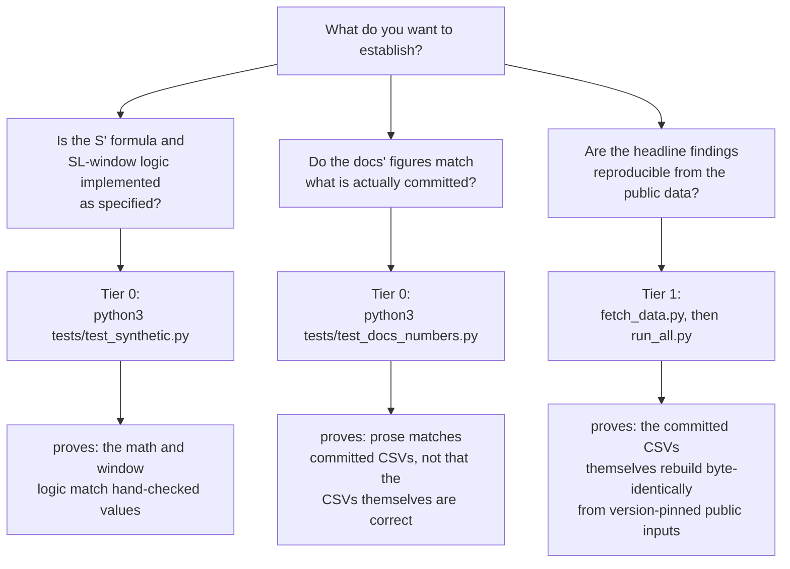

# Verifying the claims in this repository

The other documents explain what this repository computes ([method.md](method.md)), what its
controls established ([evidence.md](evidence.md)), and what it deliberately does not attempt
([scope.md](scope.md)). None of them tell you what to *run*. This document does — organized by
what you can establish, in increasing cost, so a reviewer can stop as soon as they have the
confidence they need.

Every claim in this repository stands on up to two legs: **prior art** (established
independently in the literature, cited where it is used) and **executed here** (produced by
this code from version-pinned public inputs, and re-runnable by you). Some claims have both legs,
some have only one, and one has a leg that is missing entirely — this document says so plainly
rather than leaving it implicit. A claim resting on neither leg would not belong in these
documents at all.

## Tier 0 — no download, no network, seconds

This is exactly what `.github/workflows/smoke.yml` runs on every push and pull request: its `locked`
job (`uv sync --locked` against the committed `uv.lock`) and its `portability` job (`pip install -r
requirements.txt` on Python 3.10 and 3.12) both run these same three steps. You can run the same steps
locally:

```bash
python3 -m py_compile $(git ls-files '*.py')
python3 tests/test_synthetic.py
python3 tests/test_docs_numbers.py
```

**`python3 tests/test_synthetic.py`** checks the S′ math and the SL-window logic against
hand-checked values, entirely on synthetic data — no PRISM or DepMap file is read. Its most
consequential single assertion is `test_sprime_worked_example`: it recomputes S′ from the
doxorubicin/A549 inputs (upper limit 1.000, lower limit 0.00103, EC₅₀ 0.2449 µM) and asserts the
result lands within 0.05 of 6.70. That anchor is the one place this repository's arithmetic and
the companion manuscript's (in review) worked example disagree — this test's expected value
*corrects* the manuscript's number. If this test ever starts failing on the arithmetic itself
(not on an unrelated import or environment problem), the far more likely explanation is a
regression in this code, not a return to the manuscript's original figure — see the worked
example in [method.md](method.md#the-worked-example). What passing this test does *not* prove:
that S′ is the right metric to compute, that the genotype calls are correct, or anything at all
about the real PRISM/DepMap data — it only proves the formula is implemented as specified,
against hand-checked numbers.

**`python3 tests/test_docs_numbers.py`** reads the committed CSVs under `results/` and
`concordance/results/` and asserts that every quoted figure in `docs/method.md` and
`docs/evidence.md` — the cohort-size table, the permutation-null table, the line-centring table,
the bootstrap-CI table, and the concordance table — matches those CSVs exactly, formatted the
same way the prose formats them. It also pins each CSV's row shape first (`gene` column equal to
`["PTEN", "CDKN2A", "RB1", "TP53"]`) before checking values row by row, specifically so that a
CSV that lost rows — regenerated short, truncated, or emptied — cannot pass vacuously by having
nothing left to check. What passing this test does *not* prove: that the committed CSVs
themselves are correct, only that the prose in `docs/` has not drifted from whatever numbers are
currently committed. Tier 1 below is what establishes that the CSVs are correct in the first
place.

Eight results artifacts are committed to this repository specifically so a reader can open them
without running anything at all:

| File | What it holds |
|---|---|
| `results/candidate_null.csv` | per-gene candidate counts, permutation-null mean, empirical p, permutation FDR |
| `results/line_centring.csv` | per-gene cohort offset, raw/centred candidate counts, ΔpS′ correlation |
| `results/bootstrap_ci_summary.csv` | per-gene survivor counts at each of the three bootstrap gates |
| `results/bootstrap_ci_gate.csv` | the per-candidate bootstrap intervals underlying that summary |
| `results/lung_genotypes.csv` | the called genotype (0/1/2) for all four genes, all 94 lung lines |
| `results/blocking_summary.txt` | a human-readable rendering of the first two controls |
| `concordance/results/concordance_report.csv` | per-gene reference-in-universe, recovered, and enrichment p |
| `results/demeter_validation.csv` | per-target DEMETER2 RNAi cross-check: ΔpD, direction, one- and two-sided FDR-corrected q |

Opening these is Tier 0 too — no code needs to run for a reader to see the numbers `evidence.md`
quotes from them; `test_docs_numbers.py` is what makes that quoting checkable by machine rather
than by eye.

## Tier 1 — full reproduction from public inputs (~560 MB, deterministic under pinned dependencies)

This tier has been run start to finish at least once: all three inputs fetched and md5-verified against
the pins, `run_all.py` completed, and `concordance_enrichment.py` and `demeter_validation.py` run
separately afterward. All seven committed artifacts reproduced byte-identical — every candidate count,
every permutation p-value, every FDR, every bootstrap survivor count, and `results/line_centring.csv`'s
`corr_dps` column, including `concordance/results/concordance_report.csv`'s permutation p-values. What
makes that last one no longer a caveat is described under "Determinism by construction."

```bash
pip install -r requirements.txt
python3 fetch_data.py          # md5-verifies PRISM + DepMap (required) and DEMETER2 (optional)
python3 run_all.py             # sprime_pipeline.py, then blocking_analyses.py, then bootstrap_ci_gate.py
```

Optionally, after `run_all.py`:

```bash
python3 concordance/concordance_enrichment.py --reference concordance/reference_seed_grounded.csv
python3 demeter_validation.py                                    # needs the optional DEMETER2 input
```

`demeter_validation.py` is the most expensive analysis in this repository to reproduce. It needs both the
optional ~161 MB DEMETER2 input (`fetch_data.py --only demeter2_rnai`) and a rebuilt
`results/sprime_lung_pairs.csv` from step 1 above — that intermediate table is gitignored as too large to
commit, so it must come from a completed `run_all.py` run rather than from the committed `results/*.csv`
files alone. `results/demeter_validation.csv` itself, its output, is committed, so Tier 0 above already
lets a reader check its figures without paying either of those costs.

Three guarantees make re-running this tier meaningful rather than merely time-consuming:

**Version-pinned, dual-verified inputs.** `fetch_data.py` resolves each source through
figshare's *versioned* article API (`article_id` + `version`, not "latest"), so a later release
of the same dataset cannot silently substitute itself even if figshare's default view changes.
Each download is streamed to a `.part` file and checked against a hard-pinned md5 **and** byte
size before being moved into place with `os.replace`; a file that fails either check is renamed
to `.bad` and the canonical path is never written, so a corrupted or wrong-release file can never
reach the pipeline undetected. `sprime_pipeline.py` re-verifies the md5 again at read time and
exits 2 if an input file is simply missing, or 3 if a file is present but its md5 matches neither
the pinned DepMap 24Q2 release nor the (separately pinned) 24Q4 release — so a later DepMap
release cannot substitute itself even if a reviewer's `data_sources/` already has a differently
named or differently sourced file.

**Determinism by construction, under the pinned dependency versions.** All three RNG-using scripts
(`blocking_analyses.py`, `bootstrap_ci_gate.py`, `concordance/concordance_enrichment.py`) default `--seed`
to `20260811`. Every sort in `sprime_pipeline.py` that determines row order or duplicate resolution uses
`kind="stable"` explicitly, and derived tables are written in a canonical sort order before every write.
Under `requirements.txt`'s pinned numpy 2.1.3 / pandas 2.2.3 / scipy 1.14.1, this is what makes every
committed artifact byte-identical, not merely "the same numbers in some order." The `locked` job in
`.github/workflows/smoke.yml` runs `uv sync --locked` against the committed `uv.lock` on every push, so a
rerun in CI is always against exactly this pin, not merely "some recent enough version" — and `uv.lock`
drifting from `pyproject.toml` fails that job outright.

Under a *newer*, unpinned numpy the guarantee has actually been put to the test, not merely asserted: a
full Tier 1 run against numpy 2.2.6 / pandas 2.3.3 / scipy 1.15.3 reproduced all seven then-committed
artifacts byte-identical — every candidate count, every permutation p-value, every FDR, every bootstrap
survivor count, and `results/line_centring.csv`'s `corr_dps` column, including
`concordance/results/concordance_report.csv`'s permutation p-values, which exercise the
`sorted(universe)` fix for Python's per-process string-hash randomisation.

That last one used to be the one exception, and the underlying cause is still there: `np.corrcoef`
(`blocking_analyses.py:78`) computes through BLAS, whose summation order varies between library builds,
so the raw float64 `corr_dps` value can still differ from a different build in its last ULP or two (e.g.
CDKN2A `...39013` vs `...39008`; RB1 `...15146` vs `...15147` were observed pre-fix). What changed is that
every reported writer — including `line_centring.csv`'s — now formats with `float_format="%.12g"`
(the six writers listed in `blocking_analyses.py`, `bootstrap_ci_gate.py`,
`concordance/concordance_enrichment.py`, and `demeter_validation.py`), which rounds to 12 significant
digits before the value ever reaches disk. That is comfortably coarser than the last-ULP BLAS divergence,
so the *committed* CSV is now stable across BLAS builds, not merely stable in its first three displayed
decimals. `results/sprime_lung_pairs.csv` is the one file this does not apply to — it is an intermediate
re-read at full, unrounded precision by four downstream scripts, so rounding it would shift every
downstream number rather than merely how it is displayed; it stays gitignored and is not asserted on here
for exactly that reason. A reviewer who reruns Tier 1 under the pinned versions and gets different
numbers in any *committed* CSV, under any numpy, has found a real discrepancy worth reporting.

**Loud, not silent, failure.** `run_all.py` propagates `sprime_pipeline.py`'s exit code and
stops before running the downstream controls on a bad build; a step-2 or step-3 failure is
reported by name rather than surfacing only as a bare non-zero exit.

Checkpoints to watch for while Tier 1 runs:

- Step 1 prints `VALIDATION doxorubicin/A549 S' = 6.7040  (expect ~6.70)  PASS` — the same anchor
  Tier 0 checks in isolation, now computed from the real, downloaded PRISM file rather than from
  hand-entered inputs.
- Step 1 prints the per-gene cohort sizes (`WT=`, `mut=`) against the Supplement 9 comparison —
  see the cohort table in [method.md](method.md#calling-genotypes).
- The regenerated `results/*.csv` files should be byte-identical to the committed copies under the
  pinned dependency versions (where a committed copy exists — `results/sprime_lung_pairs.csv` itself
  is gitignored as too large to commit, per `.gitignore`). `diff` or `git diff --stat` against the
  committed CSVs is the direct check; expect it to come back empty, including `line_centring.csv`'s
  `corr_dps` column, even under a different environment's numpy — the fixed `%.12g` write precision is
  what makes that true (see "Determinism by construction" above).

## What each command substantiates

| Claim | Prior art | Executed here | Standing |
|---|---|---|---|
| S′ = 6.704 for doxorubicin/A549 | — | `test_synthetic.py`, Tier 0 | verified; **corrects** the manuscript's arithmetic |
| Candidates sit at the permutation null (RB1 marginal) | — | `run_all.py` -> `candidate_null.csv` | reproducible finding |
| No gross general-sensitivity confound | — | `run_all.py` -> `line_centring.csv` | reproducible finding |
| Lists thin sharply under bootstrap CI | — | `run_all.py` -> `bootstrap_ci_summary.csv` | reproducible finding |
| RB1 loss -> Aurora dependency, recovered beyond chance (drug response) | Gong 2019 [L3], Oser 2019 [L4] | p = 0.0013 | **both legs — strongest claim here** |
| TP53 -> KIF11 enrichment (drug response) | **none** | p = 5.6e-08, one seed row | computation only |
| CDK4/6 WT-selective under RB1 loss (RNAi) | Michaud 2010 [L5] | q_two = 0.0081, `results/demeter_validation.csv` | **both legs** — prior art and a committed, obtained result |
| RB–E2F axis + AKT1 mutant-selective under RB1 loss (RNAi) | — | q_two = 0.0081-0.0493, `results/demeter_validation.csv` | reproducible finding |
| AURKA/AURKB dependency under RB1 loss (RNAi) | — | q_two = 0.5487 / 0.7789, not significant | tested, not supported by RNAi (Aurora's evidence is the drug-response row above) |
| TP53 -> KIF11 dependency (RNAi) | — | q_two = 0.1159, not significant | tested, borderline — directionally consistent with the drug-response row above, not confirmatory |
| CDKN2A inactivated mainly by deletion | TCGA 2012 [L6] | — | prior art only; motivates gap in [scope.md](scope.md) |
| 4PL pathology percentages (36% / 36% / 3% / 49%) | manuscript's own audit | — | attributed, not computed, not checkable here |

The full citation list for the bracketed references above lives in the `## References` section
of [method.md](method.md) and [evidence.md](evidence.md); this table does not reproduce it.

## What cannot be verified

Two things, stated plainly rather than left implicit:

- **The 4PL pathology percentages.** The 36% / 36% / 3% / 49% figures quoted in
  [method.md](method.md#why-the-standard-summaries-fail) are the companion manuscript's own audit
  of its 4PL fits. This repository does not compute them, does not have the code that produced
  them, and cannot reproduce or check them — they are attributed, not verified.
- **Anything about the companion manuscript itself.** Its claims, its own analysis code, and its
  review status are all outside this repository. What this repository verifies is its own
  re-derivation from the same public data, not the manuscript's process.

## Worked example — the permutation-null result, end to end

The headline finding — that candidate lists are largely indistinguishable from what random
genotype labels would produce, and that only RB1 comes close to rising above that null — needs
only Tier 1.

1. Run `python3 run_all.py`. Step 2 invokes `blocking_analyses.py`, which draws 2,000 label
   permutations per gene (`--seed 20260811` by default), reapplies the identical SL window to
   each shuffled wild-type/mutant split, and compares the real candidate count against that null
   distribution.
2. Open `results/candidate_null.csv`. For RB1, the committed row reads:
   `RB1,1360,94,0.069...,63.554,0.095...,0.676...` — 1,360 compounds tested, 94 real candidates,
   a null mean of 63.6 candidates, an empirical p of 0.095, and a permutation FDR of 0.68.
3. Compare against `evidence.md`'s Control 1 table, which quotes the same row rounded:
   `| RB1 | 94 | 63.6 | 0.095 | 0.68 |`. `tests/test_docs_numbers.py` is what keeps that
   quoting from silently going stale.
4. How you would know if it disagreed: a rerun that produced a materially different candidate
   count (not 94), a different null mean (not close to 63.6), or an empirical p that moved past
   roughly 0.5 in either direction would mean either the input files differ from the pinned
   releases (check the md5s `fetch_data.py` reports) or a real, reportable discrepancy in the
   pipeline. Because the permutation seed is fixed and every sort is stable, a correct rerun
   against the same pinned inputs should reproduce this row exactly, not merely approximately.

## Which tier answers which question


